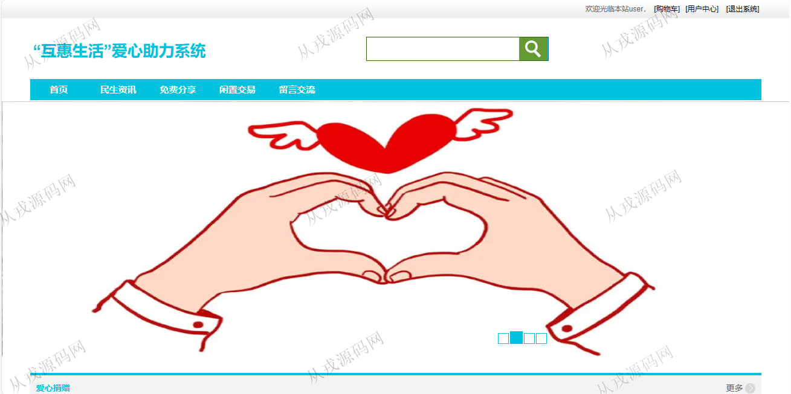

<h1 align="center">172.爱心助力商城管理系统</h1>

 获取sql文件 QQ: 386869957 QQ群: 377586148 

 [更多源码项目: 从戎源码网](https://armycodes.com/) 

## 简介

> 本代码来源于网络,仅供学习参考使用!
>
> 提供1.远程部署/2.修改代码/3.设计文档指导/4.框架代码讲解等服务
> 
> 用户端登录地址：http://localhost:8080/index/preLogin.action
> 
> 用户：user 123456
> 
> 管理后台登录地址：http://localhost:8080/admin/index.action
> 
> 管理员：admin 123456
>

## 项目介绍
基于ssm的爱心助力商城管理系统：前端 jsp、jquery，后端 springmvc、spring、mybatis；角色分为管理员、用户；集成闲置交易、购物车、我的订单、收藏等功能于一体的系统。

## 功能介绍

### 用户

- 基本功能：登录，注册，退出，用户信息查看与修改，密码修改
- 网站首页：主导航栏，轮播图，爱心捐赠，二手商品，全局搜索
- 闲置交易：商品列表展示，商品详情，购物车，在线结算
- 用户中心：我的订单列表查询，我的收藏
- 留言交流：留言信息列表查询，发表帖子

### 管理员

- 管理员信息管理：管理员信息的增删改查，密码修改
- 用户登录模块：用户信息列表查询，锁定和解锁，用户信息由用户在前台自行注册
- 网站栏目管理：栏目信息的增删改查
- 商品类型信息管理：类型信息的增删改查
- 商品管理：商品信息的增删改查
- 订单支付管理：用户下单后，管理员可以查询用户订单信息
- 留言交流信息管理：用户在前台留言，管理员可以查看和删除留言信息

## 环境

- <b>IntelliJ IDEA 2021.3</b>

- <b>Mysql 5.7.26</b>

- <b>Tomcat 7.0.73</b>

- <b>JDK 1.8</b>

## 运行截图

